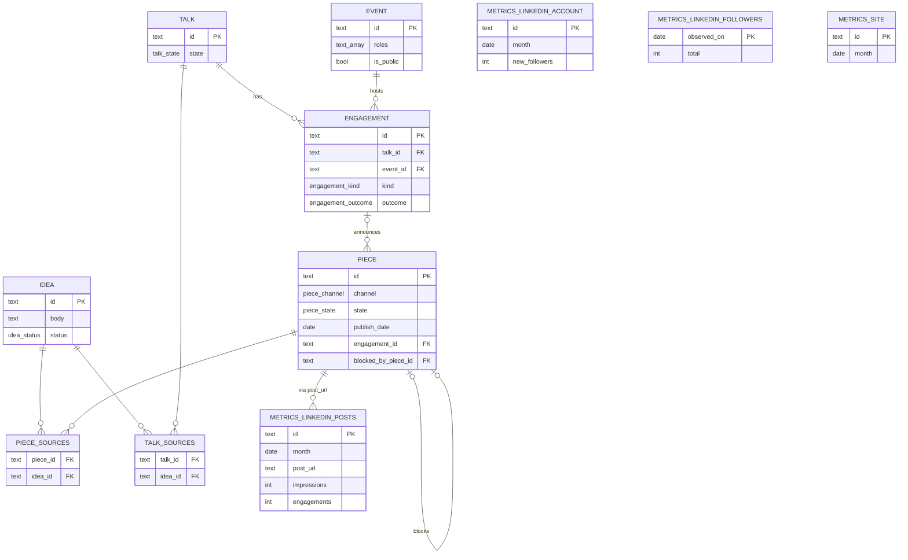

# Supabase foundations — Fase 1 design

Concrete design for the Supabase (Postgres) source of truth introduced by
[ADR-0014](../adr/0014-pipeline-source-of-truth-moves-to-supabase.md). This is the model + contract; the
**authoritative, runnable DDL is the first migration**
(`supabase/migrations/*_init.sql`). Vocabulary is the [glossary](../../CONTEXT.md).

Tiers: **Idea → {Piece, Talk}** (many-to-many) · **Talk → Engagement → Event**.

## ER

## Entities

- **ideas** (`idea_…`) — a spark in a persistent pool. `status` ∈ `live` (default) / `archived`;
  `body` (spark verbatim), optional `title`, `archived_reason`, `duplicate_of` (self-ref, for dedup),
  `source`. **Never rejected.**
- **pieces** (`piece_…`) — a dated output on a cadence channel. `channel` ∈ `blog`/`linkedin` (enum);
  `flag_side`; `state` ∈ `proposed`/`slotted`/`ready`/`published`/`declined` (ADR-0018: `ready` replaced
  `in_production`); `publish_date`;
  `blocked_by_piece_id` (self-ref); `engagement_id` (nullable — accepted-talk announcement); `artifact_url`.
  Source Ideas via **`piece_sources`** (N-M).
- **talks** (`talk_…`) — dateless. `flag_side`; `state` ∈ `proposed`/`in_production`/`ready`/`declined`;
  `brief_url` (TALK.md). Source Ideas via **`talk_sources`** (N-M).
- **engagements** (`eng_…`) — a Talk taken to an Event. `kind` ∈ `cfp`/`direct`; `outcome` ∈
  `to_submit`/`submitted`/`accepted`/`rejected` (cfp) or `confirmed` (direct), enforced by a check;
  `deadline`/`cfp_link`/`answers_path` (cfp only); FK `talk_id`, `event_id`. The **accepted** engagement
  is the only Talk↔Event link.
- **events** (`event_…`) — `name`, `starts_on`/`ends_on`, `location`, `url`, **`roles` `text[]`**
  (organizer, mc, …; speaking is *derived* from an accepted engagement), **`is_public`**.
- **metrics_linkedin_posts** (`mlp_…`) — per post per `month`: `post_url`, `posted_on`, `impressions`,
  `engagements` (a single combined figure — the export has no reaction/comment/reshare split; ADR-0019).
  Per-period, so a still-active post has a row per month; the Piece link is **`pieces.linkedin_post_url`**
  (the post's stable identity), joined by URL — not an FK — so it rolls up every monthly slice.
- **metrics_linkedin_account** (`mla_…`) — the monthly account-level snapshot: `month` (unique),
  `impressions`, `members_reached`, `new_followers` (ADR-0019). Every field is a **quantity of the period**,
  and the period is the row's key — which is why the follower **level** is not here (#113).
- **metrics_linkedin_followers** — the follower **level**, keyed by **`observed_on` (the primary key)** with
  `total`. The export reports the total at export time, always after the month has ended, so a level on a
  month-keyed row is wrong by construction; keyed by the day it was read it cannot lie, and the rows accrue
  a level series (#113). Re-recording a date replaces it.
- **metrics_site** (`mst_…`) — monthly `visitors`/`page_views` (the website), read by hand from the Umami
  Cloud dashboard (free plan → no API; Vercel Analytics until mid-July 2026).

## RPC verbs (the API contract)

Atomic multi-step writes are Postgres functions; skills call them through the content-os MCP adapter, the
front end calls them directly via PostgREST (ADR-0015). Reads are MCP **tools** over tables/views
(`list_ideas`, `list_proposals`, `list_calendar`) for MCP-only clients, and direct PostgREST for the front
end. `capture_idea` shipped in the init migration; the Piece/Talk write verbs (`spawn_piece`, `slot_piece`,
`deslot_piece`, `decline_piece`, `spawn_talk`, `decline_talk`) shipped in the Fase-4 ops slice; the rest
land as they're built.

| Verb | Does |
| --- | --- |
| `capture_idea(body, title?, source?)` | Insert one `live` Idea. **The only verb the insert-only capture token may call.** |
| `archive_idea(idea_id, reason, duplicate_of?)` | Set `archived` (reversible). |
| `spawn_piece(channel, flag_side, title, idea_ids[])` | Insert a `proposed` Piece + link its source Ideas, one tx. Always persisted. |
| `spawn_talk(flag_side, title, idea_ids[])` | Insert a `proposed` Talk + link source Ideas, one tx. |
| `decline_piece(id)` / `decline_talk(id)` | Set `declined` — kept on the record so correlation won't re-propose. |
| `block_piece(blocked_id, blocker_id)` | Set `blocked_by_piece_id`. |
| `slot_piece(id, on_date)` / `deslot_piece(id)` | Slot/de-slot on the Calendar. |
| `mark_ready(id)` | Advance a slotted Piece to `ready` — written, in the can, awaiting its date (keeps its date). From-state-guarded (slotted-only); called by the console (ADR-0018). |
| `publish_piece(id)` | Advance a `slotted`/`ready` Piece to `published` (keeps its date). From-state-guarded; called by the console (ADR-0017, widened to `ready` by ADR-0018). |
| `create_engagement(talk_id, event_id, kind, deadline?, cfp_link?)` | Insert an engagement. |
| `set_engagement_outcome(id, outcome, conference-date via event)` | Advance the outcome. |
| `set_piece_artifact(piece_id, url)` | Write the Factory draft pointer into `pieces.artifact_url`. Called by the Factory skills. |
| `set_piece_linkedin_url(piece_id, url)` | Attach a LinkedIn post URL to a `linkedin` Piece (guarded to channel; null clears). The per-Piece metrics cross joins on it (ADR-0019). Called by the console; MCP-adapter parity is a later additive step. |
| `ingest_linkedin_metrics(month, csv_text)` | Deterministic parse of the per-post CSV (`date, post_url, impressions, engagements`) + replace that month's rows in `metrics_linkedin_posts` (ADR-0019, replaces the retired `contentos metrics-ingest` per ADR-0015). |
| `record_linkedin_account(month, impressions?, members_reached?, new_followers?)` | Upsert a month's LinkedIn account-level snapshot into `metrics_linkedin_account` (ADR-0019; the follower level left this verb with the column, #113). |
| `record_linkedin_followers(observed_on, total)` | Record the follower **level** on the date it was observed (upsert on that date — re-recording replaces). **Raises with no observation date**: a level without its date is the lie the key exists to prevent (#113). |
| `record_site_metrics(month, visitors?, page_views?)` | Upsert a month's website numbers into `metrics_site`. |

Advancing a Piece to `ready`/`published` has its own guarded verbs (`mark_ready`/`publish_piece`,
ADR-0018/0017). Advancing a **Talk** to `in_production`/`ready` is still a plain state update — no verb yet,
added when a consumer needs one (the deferred-guard rule from the ops slice).

## Views

- **`public_events`** — the public read surface for `davideimola.dev` (`anon`): `is_public` events +
  the accepted engagement's talk title. Base tables stay behind RLS; the site never reads them.
- **`flag_mix`** — flag vs side over **Pieces + Talks** (~70% target).
- **`cadence_status`** — this week's LinkedIn slot + this month's blog (**Pieces only**).
- **`untriaged_proposals`** — `proposed` Pieces/Talks awaiting a pursue/decline. **This is the Beats'
  new staleness signal** (Ideas are a live pool, never "unjudged").

## Capture surface & RLS

- **`capture-idea` REST Edge Function** — the insert-only door for REST clients (ChatGPT Custom GPT
  Action, curl). The `anon` key can *only* `execute` `capture_idea` (a `security definer` function) — no
  table access — so a leaked token inserts an Idea and nothing more.
- **`content-os` MCP Edge Function** (grows from `capture-mcp`) — the **operations adapter** for AI apps
  (Claude, Perplexity, mobile) and the skills (ADR-0015). A thin wrapper that exposes **all** RPC verbs as
  tools over Streamable HTTP, authenticated by a single shared token, with no logic of its own —
  least-privilege *by construction* (only the verbs, nothing else), which is why it replaces ADR-0014's
  "official Supabase MCP" plan. `capture_idea` is just one of its tools.
- **Front end** (later) reads/writes via **direct** PostgREST / `supabase-js` over the same RPCs — not
  through the MCP or the skills.
- RLS is enabled on every base table (deny-by-default for `anon`/`authenticated`); `service_role`
  bypasses it. Fuller policies are a later slice.

## Migration mapping (old GitHub issue → new row)

One-shot from `gh issue list --repo davideimola/content-os --json ...`:

| Old (issue + labels + Projects) | New |
| --- | --- |
| `idea` (open, any child count) | `ideas` (`live`) |
| `idea` (closed / was "rejected") | `ideas` (`archived`, reason from the closing comment) |
| channel `blog`/`linkedin` + state label, child of an Idea | `pieces` (state → `piece_state`; Projects `Date` → `publish_date`; `flag`/`side` → `flag_side`) + a `piece_sources` row to the parent Idea |
| **channel `talk`** + state label | **`talks`** (`proposed`→`proposed`, `in-production`→`in_production`, `slotted`/`published`→`ready`) + a `talk_sources` row |
| `cfp` + `talk` | **`engagements`** (`kind = cfp`; `talk_id` from the body's Talk ref; Outcome → `engagement_outcome`) |
| the `conference` text on an old CFP | **`events`** (dedup by name; `conference_date` → `starts_on`) |
| native `blocked_by` dependency | `pieces.blocked_by_piece_id` |
| `metrics/<YYYY-MM>/*.csv` | `metrics_linkedin_posts` / `metrics_site` |

Old `accepted`/`unjudged` Idea states both collapse to `live` (judgement moved to the output). The talk
date that no longer fits the dateless Talk is dropped; backfill an `engagement` only where a real
conference is known.

## Migrations

Managed by the **Supabase CLI** (`supabase migration new`, `supabase db push`); files in
`supabase/migrations/<ts>_*.sql`, applied in timestamp order and tracked in
`supabase_migrations.schema_migrations`. Up-only — reverse by writing a new migration. Edge Functions live
in `supabase/functions/`. IDs are Stripe-style prefixed text via `gen_prefixed_id(prefix)` — for
**entities**. A row that is a **fact identified by its own key** carries no surrogate id: the join tables
(`piece_sources`, `talk_sources`, `idea_themes`, `piece_themes`) are keyed by the pair they relate, and
`metrics_linkedin_followers` by `observed_on`, because the date the level was observed *is* its identity
(#113) and a second identity beside it would make "one observation per date" a constraint rather than the
key.
